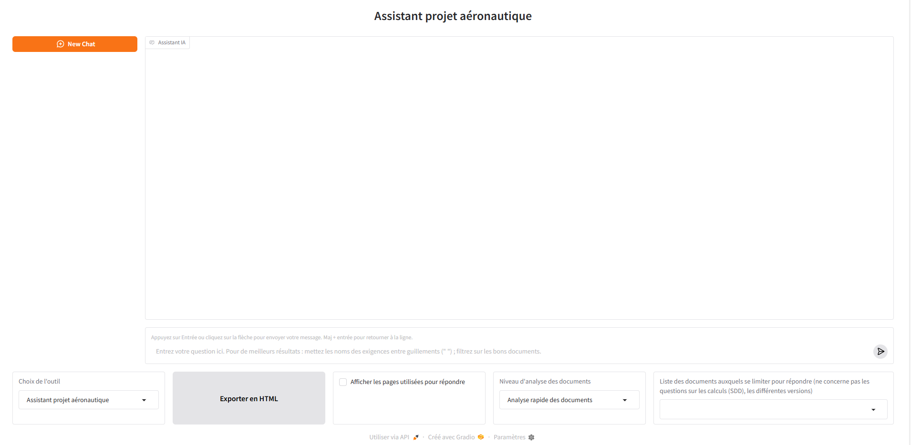
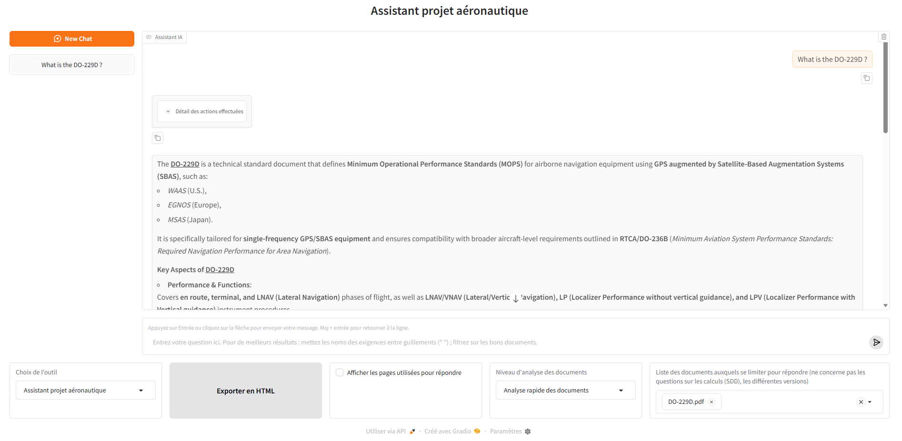
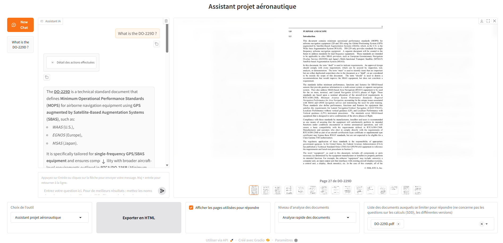

# ATLAS — Aerospace Technical LLM ASsistant

An AI-powered Retrieval-Augmented Generation (RAG) platform developed during an R&D internship at **Thales AVS**. ATLAS enables avionics engineers to query large corpora of technical documents (PDFs, Word, Excel, HTML, XML) using natural language, and to automate certification-related engineering tasks.

## Context

Built during a generative AI R&D internship at **Thales AVS** (Valence, France), April 2024 – February 2026. Avionics projects generate thousands of heterogeneous documents; certification requirements (DO-178C, DO-254) produce large volumes of requirements, tests, and traceability documents that engineers must cross-reference constantly. ATLAS was designed to reduce the time spent on manual document search and on repetitive writing tasks.

A full presentation of the system is available in [`Présentation OPEN.pptx`](Présentation%20OPEN.pptx).

## Two Operating Modes

**Informative — conversational assistant**
- Query an LLM-RAG agent that dynamically dispatches questions to multiple specialized RAG systems
- Explains the product, locates documents, surfaces links between requirements
- Cites source documents and pages in every answer for traceability

**Generative — engineering task automation**
- Analyze a High-Level Requirement (HLR): inputs, outputs, interactions, performance constraints
- Check test coverage of an HLR against existing High-Level Tests (HLT)
- Generate a test architecture from an HLR analysis
- Analyze traceability between HLR and Software Requirements (SR)
- Assist with Change Impact Analysis (CIA), FBL/ABL document updates

## Ingestion Pipeline

ATLAS handles two document families:

**Unstructured / multimodal (PDF, Word, Excel, HTML)**
- PDFs and Word files are parsed with **Docling** → Markdown, preserving tables, figures, and heading hierarchy; figures are annotated with Mistral when relevant
- Chunking is hybrid: first by heading structure, then by token count (≤ BGE-M3's 8192-token window), with post-processing to avoid splitting tables
- Excel sheets are chunked by row groups (≤ 2 000 tokens), always repeating header rows in each chunk
- HTML files are converted to Markdown with `html2text`, then split hierarchically by heading and by token with LangChain's `RecursiveCharacterTextSplitter` (2 000 tokens, 200 overlap)

**Structured (XML / TXT requirement trees)**
- XML is converted to JSON (lighter for LLMs), then chunked if > 8 000 tokens
- Each chunk always includes the full folder/file path as a prefix and as metadata for filtering

## Retrieval

**Hybrid RAG** — combines two retrieval modes, fused with Reciprocal Rank Fusion (RRF):
- **Semantic search** — ChromaDB vector store + BGE-M3 embeddings (multilingual, 8 192-token context)
- **Keyword search** — Whoosh full-text index with BM25F scoring (useful for requirement names, acronyms, identifiers)

**Visual RAG** — for system design documents (SDD) where formulas and diagrams dominate:
- Page images are indexed with **ColSmol 256M** (ColPali family, runs on 4 GB VRAM)
- Mistral Medium (multimodal) reads the retrieved page images directly

## Agentic Workflow

The conversational assistant is orchestrated by a **LangGraph** agent that:
1. Dispatches the query to the appropriate RAG systems (hybrid, visual, or folder-tree tool)
2. Aggregates retrieved chunks and page images
3. Generates the final answer with Mistral Medium (temperature = 0, frequency penalty = 0.05)
4. Extracts and returns cited sources and page numbers

## Gradio Interface



- Chat interface with conversation history
- Document filter to restrict retrieval to specific files
- Analysis mode selector (informative vs. generative workflow)
- Source viewer: cited pages displayed inline
- HTML export of conversations





## Installation

**Requirements:** Python 3.13, a Mistral API key, a BGE-M3 embedding API, and a GPU with ≥ 4 GB VRAM for visual RAG (optional).

```bash
pip install -r requirements.txt
```

Download the following models from HuggingFace and place them in a `models/` directory:
- [`BAAI/bge-m3`](https://huggingface.co/BAAI/bge-m3) → `models/bge-m3/`
- `colSmol-256M` → `models/colSmol-256M/` *(optional, for visual RAG)*
- Docling artifacts → `models/docling_artifacts/`
- Mistral tokenizer (`tekken.json`) → `models/tekken.json`

Then set `BASE_PATH` in `my_paths.py` to the absolute path of your installation directory.

### Running the interface

```bash
python interface_gradio.py
```

The Gradio UI will be available at `http://localhost:7860`.

### Ingesting documents

Place your raw documents (PDF, Word, Excel, HTML, XML/TXT) in `data/Raw_database/`, then run:

```bash
python update_databases_full_pipeline.py
```

This runs the full pipeline: Word → PDF conversion, Docling parsing, chunking, figure annotation, vectorization into ChromaDB and Whoosh, and visual RAG embedding. Re-running it is incremental — only new or removed documents are processed.

## Tech Stack

| Category | Tools |
|---|---|
| Language | Python 3.13 |
| LLMs | Mistral (small / medium / large) |
| Embeddings | BGE-M3 (local, via HuggingFace) |
| Vector store | ChromaDB |
| Keyword search | Whoosh (BM25F) |
| Retrieval fusion | Reciprocal Rank Fusion (RRF) |
| Agentic framework | LangChain + LangGraph |
| Visual retrieval | ColSmol 256M (ColPali family) |
| PDF parsing | Docling, PyMuPDF |
| UI | Gradio |
| Evaluation | RAGAS (Faithfulness, Answer Relevancy, Context Precision) |

## Project Structure

```
ATLAS/
├── my_rag.py                      # Core RAG pipeline (retrieve + answer)
├── my_agentic_rag.py              # Agentic RAG with multi-step reasoning
├── agentic_workflow.py            # High-level workflow orchestration
├── hybrid_search.py               # Hybrid dense + sparse retrieval
├── interface_gradio.py            # Web UI
├── ragas_evaluation.py            # Retrieval evaluation
├── manage_glossary.py             # Domain glossary integration
├── visual_rag_on_sdd.py           # Visual RAG on system design documents
├── process_pdf_documents/         # PDF ingestion pipeline
├── process_html_documents/        # HTML ingestion
├── process_excel_documents/       # Excel ingestion
├── workflows/                     # Specialized engineering workflows
│   ├── requirement_analysis.py
│   ├── workflow_HLR_analysis.py
│   ├── workflow_HLT_coverage.py
│   └── ...
└── requirements.txt
```
